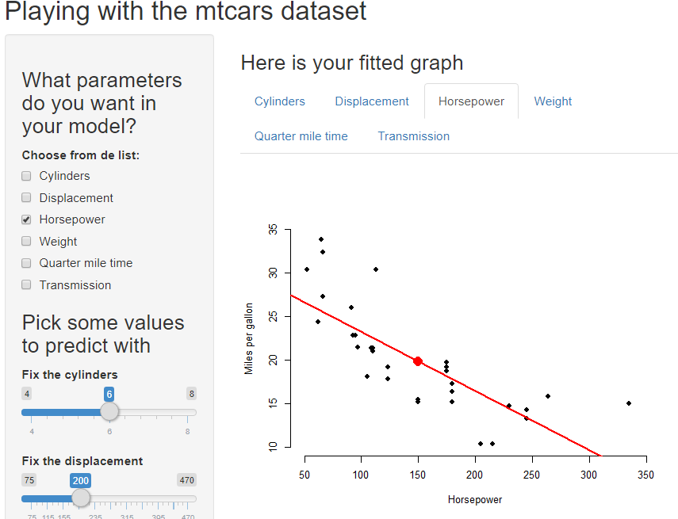
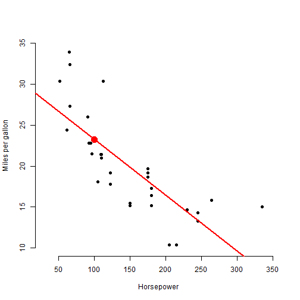

<style>
.small-code pre code {
  font-size: 0.5em;
}
</style>
<style>
.text {
      margin: 40px;
      background-color: #FFEA4C;
    }
</style>
<style>
img {
      width: 60%;
      heigth: auto;
    }
</style>

Cars analysis
========================================================
author: Patricia Esteban-Infantes
date: December 7, 2020
autosize: true

A presentation for the assignment on data products of the Data Specialization from Coursera.

You can find the Shiny app in this url: https://github.com/PatriciaJEI/my_cars_app/tree/main/Cars_analysis

And the github repository containing the full code in this url: https://patriciajei.shinyapps.io/cars_analysis/

The idea
========================================================
class:text
My app fits different linear models for the mtcars dataset.
- You can select one or more variables as predictors among the number of cylinders (cyl), the displacement (disp), the gross horsepower (hp), the weight (wt), the quarter mile time (qsec) and the type of transmission (am). 
- The app fits a linear model with miles per gallon (mpg) as outcome. 
- You can also use six sliders to input new data and predict the corresponding miles per gallon.
- It produces one plot of the mtcars dataset for each pair (mpg vs. other variable), with the prediction line and value.

Preview of the app
========================================================

This image shows a piece of what you can see when running the app, with the checkboxes for the variables, the input sliders and the fitted graphs.

        
</img>
Server code
========================================================
class:small-code
This slide shows the structure of the server.R code of the app, with some simplifications (some repeated structures of the code have been omitted due to its really long extension) to try to fit it in the computer screen without getting cut off.

```r
library(shiny); library(datasets); data("mtcars")
shinyServer(function(input, output) {
##### Producing the linear model
    model <- reactive({lm(as.formula(paste("mpg ~ ", paste0(input$predictors, collapse="+"))),data=mtcars)})
    intercepts <- reactive({
        int <- numeric(0)
        if("cyl" %in% input$predictors){int <- c(int, model()$coefficients["cyl"])}else{int <- c(int, 0)}
        ######## The same for the remaining 5 variables, but it is too long to include in the slide
        int})
##### Predicting with the input values
    modelPred <- reactive({
        cylIn <- input$slider_cyl; dispIn <- input$slider_disp; hpIn <- input$slider_hp; wtIn <- input$slider_wt; qsecIn <- input$slider_qsec; amIn <- input$slider_am
        predict(model(), newdata = data.frame(cyl=cylIn, disp=dispIn, hp=hpIn, wt=wtIn, qsec=qsecIn, am=amIn))})
##### Producing the 6 graphics: mpg vs. variable, for the six selected variables
    ######## Cylinders
    output$Plot1 <- renderPlot({
        cylIn <- input$slider_cyl; dispIn <- input$slider_disp; hpIn <- input$slider_hp; wtIn <- input$slider_wt; qsecIn <- input$slider_qsec; amIn <- input$slider_am
        plot(mtcars$cyl, mtcars$mpg, xlab = "Cylinders", ylab = "Miles per gallon", bty = "n", pch = 16, ylim = c(10,35), xlim = c(3, 9))
        if("cyl" %in% input$predictors){
        abline(a=model()$coefficients["(Intercept)"]+intercepts()[2]*dispIn+intercepts()[3]*hpIn+intercepts()[4]*wtIn+intercepts()[5]*qsecIn+intercepts()[6]*amIn, b=model()$coefficients["cyl"], col = "red", lwd = 2)
        points(cylIn, modelPred(), col = "red", pch = 16, cex = 2)}})
    ######## Now the code repeats the last structure for the other 5 variables, but it is too long to include in the slide.
##### Prediction message
    output$pred <- renderText({paste(round(modelPred(),3), "Miles per Gallon", sep =" ")})
})
```

Sample of the produced output
========================================================
class:small-code
In this slide, I show some code that has been used in the server.R, to produce an example of what can be done with the app. Imagine you chose to fit a model with horsepower as predictor, and the input values stored in the `my_values` dataframe.

***


```r
library(datasets); data("mtcars")
model <- lm(mpg~hp, data=mtcars)
intercepts <- c(0,0,model$coefficients["hp"],0,0,0)
my_values <- data.frame(cyl=6, disp=170, hp=100, wt=2.5, qsec=18, am=1)
modelPred <- predict(model,my_values)
plot(mtcars$hp, mtcars$mpg, xlab="Horsepower", ylab="Miles per gallon", bty="n", pch=16, xlim=c(30, 350), ylim=c(10,35)); abline(a=model$coefficients["(Intercept)"]+sum(intercepts[-3]*my_values[1,-3]),b=model$coefficients["hp"], col="red", lwd=2); points(my_values$hp, modelPred, col="red", pch=16, cex=2)
```


